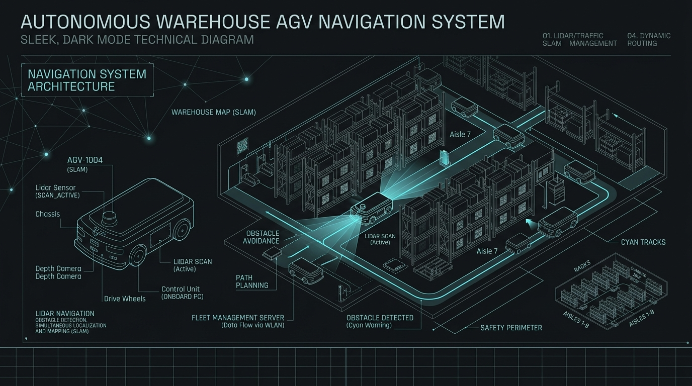
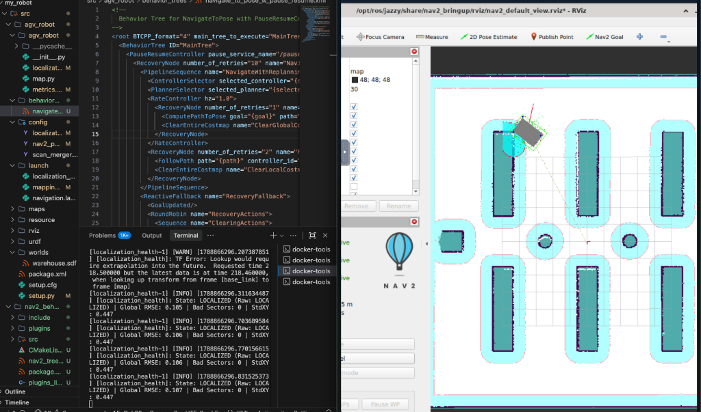

# ◆ Autonomous Warehouse AGV

<p align="center">
  
</p>

<p align="center">
  <b>Smart, safe, and self-recovering warehouse delivery robot.</b>
</p>

<p align="center">
  
  
  
  
</p>

---

## ✦ What is this project?

This project is an **Autonomous Guided Vehicle (AGV)** designed to transport goods inside a busy warehouse. 

Just like an autonomous car, the robot knows the layout of the building, plans the fastest safe route, avoids people and shelves, and safely drives itself to its destination.

<p align="center">
  
</p>

---

## ▤ Key Files & What They Do

```
my_robot/
├── assets/                               # Images and diagrams
├── docker-compose.yml                    # Starts the entire robot software in 1 click
└── src/
    ├── agv_robot/                        # Main robot controls
    │   ├── agv_robot/
    │   │   ├── localization.py           # The "Safety Guard": checks if the robot knows where it is
    │   │   ├── map.py                    # Measures how close the robot is to walls
    │   │   └── metrics.py                # Math scores that rate localization accuracy
    │   ├── behavior_trees/
    │   │   └── navigate_to_pose_w_pause_resume.xml  # Robot's "decision brain": when to drive, pause, or replan
    │   ├── config/
    │   │   ├── localization_health.yaml  # Safety score settings and thresholds
    │   │   ├── nav2_params.yaml          # Speed limits, robot size, and obstacle avoidance
    │   │   └── scan_merger.yaml          # Combines front and rear lasers for a 360° view
    │   ├── launch/
    │   │   ├── mapping.launch.py         # Starts the 3D warehouse simulation
    │   │   └── navigation.launch.py      # Starts the driving brain and screen view
    │   └── urdf/                         # The 3D robot body design and wheels
    │
    └── agv_bt/                           # Custom software plugin that adds the Pause & Resume power
```

---

## ✦ How Does the Robot Know if it is Lost?

Imagine walking in your house with the lights off: you touch the walls to confirm where you are. The robot does the exact same thing using invisible laser beams (LiDAR).

```
                      [ Laser Eyes (LiDAR) ]
                                 │
                                 ▼
                     "Do the walls I see match 
                      the walls on my map?"
                                 │
                 ┌───────────────┴───────────────┐
                 ▼                               ▼
               YES                              NO
       (Laser matches map)           (Laser doesn't match map)
                 │                               │
                 ▼                               ▼
          ● LOCALIZED                        ○ LOST
          Safe to drive!               Robot stops immediately!
```

1. **Checking against the map**: The robot compares what its laser eyes see with its saved warehouse map.
2. **360° Safety check**: It checks 8 different directions around itself (front, sides, corners, back). If even one direction looks wrong or blocked, it flags a warning.
3. **No false alarms**: It must be sure for at least 5 checks in a row before deciding it is truly lost or back on track.

---

## ✦ Pause & Resume: Self-Healing Navigation

Standard warehouse robots have a frustrating flaw: **if they get lost or bumped off course, they cancel the mission and give up**. A human must walk over, reset the robot, and enter the destination again.

**Our robot is self-healing:**

```
                  [ Robot driving to destination ]
                                 │
                                 ▼
               ◆ Robot gets bumped or loses its way
                                 │
                                 ▼
                   ■ PAUSE (Not Cancelled!)
          The robot stops in place to prevent collisions.
              The mission remains saved in memory.
                                 │
                                 ▼
                   ↻ Robot figures out where it is
             (or a person drives it back to a clear area)
                                 │
                                 ▼
                  ► RESUME & REPLAN (Automatic)
        The robot calculates a brand new route from where
            it is standing and continues on its way!
```

- **Never Cancels the Mission**: The destination is never forgotten.
- **Safety First**: As soon as confidence drops, the wheels stop so it never crashes while confused.
- **Automatic Recovery**: The second it figures out its location, it recalculates the best route from its new position and finishes the trip.

---

## ↳ Corner Protection (No Scraping Shelves)

- The robot is a large vehicle (**1.8 meters long and 1.3 meters wide**).
- Many basic navigation systems pretend the robot is just a tiny dot. When turning corners, this causes the back corners of the robot to scrape shelves.
- **Our system calculates the real shape**: It checks all **4 corners of the rectangular body** in real time before making a turn, swinging smoothly around corners with plenty of breathing room.

---

## ► Quick Start

### 1. Start the Simulation
```bash
docker compose up -d
docker exec -it agv_sim bash
source /opt/ros/jazzy/setup.bash && source /ros2_ws/install/setup.bash
ros2 launch agv_robot mapping.launch.py
```

### 2. Start Autonomous Driving
```bash
ros2 launch agv_robot navigation.launch.py
```

### 3. Start the Safety Health Monitor
```bash
ros2 run agv_robot localization_health
```

---

## Tech Stack

| Component | What it does |
| :--- | :--- |
| **Ubuntu 24.04 & ROS 2 Jazzy** | The modern operating system and robotics communication framework |
| **Gazebo Harmonic** | The realistic 3D simulation of the warehouse and physical obstacles |
| **Nav2 & MPPI** | The autonomous driving brain that plans paths and controls the wheels |
| **AMCL** | Pinpoints the robot's position on the map using laser beams |
| **Custom Safety Monitor** | Watches localization health and pauses/resumes navigation automatically |

---

<p align="center">
  <sub>Developed for safe, intelligent, and autonomous warehouse robotics.</sub>
</p>
